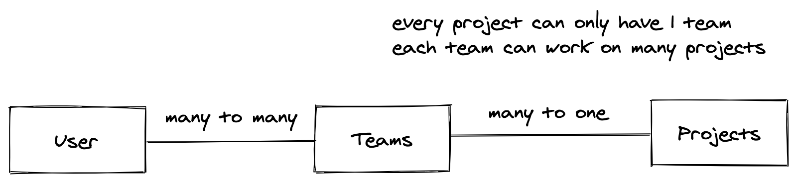
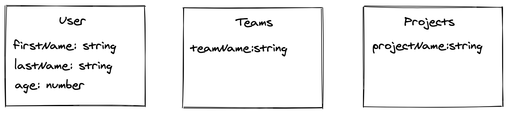

# Getting Started with TypeORM

### Why Typeorm over Sequelize

Largely the reasoning is because of Typescript support on Typeorm is cleaner. It also has both ActiveRecord and DataMapper style of arranging entities, which makes it comfortable for people coming from rails.
Also support for migration and seeding tools is pretty good. And for really complex queries you can use  the query builder to clean up your queries.

### Installation
You can follow the instructions listed in [the typeorm README](https://raw.githubusercontent.com/typeorm/typeorm/master/README.md)

> Please note that you should select `pg` as your db driver to install via NPM

> If you want to use typeorm in your CLI (as opposed to using the script inside node_modules) you can run `npm install typeorm -g` to have it installed to your shell

You will need to install `typeorm-seeding` as well in order to perform seeding for your DB
### Setting up

Start by initializing typeorm in the current project folder

```
typeorm init --database postgres
```

### Configuring your database connection

You will need to edit a file called `ormconfig.ts` to include your database connection. You can replace the words in caps with envs or actual string values.

> Information about the ormconfig file can be found [here](https://typeorm.io/#/connection-options)

```

module.exports = [
   {
     type: 'postgres',
     host: HOST_ENV,
     port: PORT,
     username: USERNAME,
     password: PASSWORD,
     database: DB_NAME,
     synchronize: false,
     logging: false,
     entities: [
        'src/entities/*.entity.{ts,js}'
     ],
     migrations: [
        'src/migrations/**/*{.ts,.js}'
     ],
     subscribers: ["src/subscribers/**/*{.ts,.js}"],
     seeds: ["src/seeds/**/*{.ts,.js}"],
     factories: ["src/factories/**/*{.ts,.js}"],
     cli: {
       entitiesDir:'src/entities' ,
       migrationsDir: 'src/migrations',
       subscribersDir: 'src/subscribers',
     },
   },
 ];
 ```

 > You can also configure for multiple connections to different databases, refer to the following [documentation](https://typeorm.io/#/multiple-connections)


### Key Files to note
Upon initialization, several files will be created by typeorm, you will need to create 2 more folders for the seeding portion of this exercise. create a folder structure similar to the one below

```
src
|
|--- entities
|--- migrations
|--- seeds
|--- factories

```

##### Entity Folder
This folder stores all your models

##### Migration Folder 
This folder contains all files related to migrating to the database

##### Seed Folder
This folder will contain the script for generating the various fake entries within the atabase

#### Factories folder
This folder will contain the class specific factories for seeding and will be used within the seeding files.
   


----
### Creating the entities.
----

> You can find the docs for creating entities [here](https://typeorm.io/#/entities) 

We will be creating entities with the following relations 


Lets begin by defining the various entities as per the following diagram



We will create the following files in the entities folder

```
src
|
|--- entities
        |--- Project.entity.ts
        |--- Team.entity.ts
        |--- User.entity.ts

```

Lets start by taking a look at the User entity and break down some of the stuff here.

```typescript
# User.entity.ts

import {Entity, PrimaryGeneratedColumn, Column, ManyToMany, JoinTable} from "typeorm";
import {Team} from './Team.entity'
@Entity()
export class User {

    @PrimaryGeneratedColumn()
    id: number;

    @Column()
    firstName: string;

    @Column()
    lastName: string;

    @Column()
    age: number;

    @ManyToMany(() => Team, (team: Team) => team.users)
    @JoinTable()
    teams!: Team[];

}
```

Firstly we notice several types of decorators:

`@Entity` - A new entity is defined by this decorator 

`@PrimaryGeneratedColumn`, `@Column` - These define that the following variables are a column.  

`@ManyToMany`, `@JoinTable` - Define relationships and how they should be generated by the migration

> More info on [decorators can be found here](https://typeorm.io/#/decorator-reference/
)

Column variables also have their types defined next to them. There are other ways to define column types as well e.g `@Column("varchar", { length: 200 })`

> For more information on what types are supported for the columns, you can refer to the [entity documentation](https://typeorm.io/#/entities/column-types)

> Lets try to create the tables for `Team` and `Project` entities


Next lets talk about the relationships associated with the User. A User will belong to many teams and a team will have many users. We can define this ManyToMany relationship with the following segment of code

```typescript
# User.entity.ts
@ManyToMany(() => Team, (team: Team) => team.users)
@JoinTable()
teams!: Team[];
```
----
```typescript
# Team.entity.ts
@ManyToMany(() => User, (user: User) => user.teams)
users!: User[];
```
Lets break down each line 

1) @ManyToMany(<Callback>) - Defines that this is a many to many relationship, the callback tells us what entity this column should return, defining the relationship with the other entity within the project.

2) @JoinTable() - This will create an intermediary table that houses the many to many relationship. 
> NOTE: You only need to declare this on one side of the many to many relationship, else you will end up with another intermediary table

3) teams!: Team[] : declares that this entity attribute houses an array of teams.

----

Similarly we can take a look at the Many to One Relation ship between `Project` and `Team`

```
@OneToMany(() => Project, (project: Project) => project.team)
projects!: Project[];
```

```
# Project.entity.ts
@ManyToOne(() => Team, (team: Team) => team.projects,{ nullable: false })
team!:Team;
}
```

Notice that for the Many to One tables, there is no need for a `@JoinTable`? That is because the id can be stored on one of the tables (Specifically the table that should belong to 1 other)

There is also a `{nullable: false}` property within the callback area, you can define properties on the columns when required. In this example, the association is set to not be nullable, thus every project should belong to a team (else there wont be anyone working on the project!).

> For more information on column properties, you can find them [here](https://github.com/typeorm/typeorm/blob/master/docs/entities.md#column-options)

### Generating a migration

Once the entities have been created, we can now generate a migration for future use. To generate a migration, you can run the following command.

```
# If you are using typeorm installed to global
typeorm migration:generate -n "first_migration"

# If you are running typeorm through node_modules
./node_modules/typeorm/cli.js migration:generate -n "first_migration"
```
> Note that you might need to install `ts-node-dev` to run typeorm from node_modules. You will need it if you encounter errors with import statement

> For your convenience, you can run the following command `npm run migration:generate` which is a pre-set command in package.json, but you will need `ts-node-dev` to run this

Once you have successfully run the migration, you will find a new file within your migration folder

```
src
|
|--- migrations
        |--- xxxxxxxxx-first_migration.ts

```

Once the migration is generated, you can then run the migration with the following

```
typeorm migration:run

# OR

ts-node-dev ./node_modules/typeorm/cli.js migration:run
```

> To rollback a migration, You can run `migration:revert` 
> Migrations are transactions, meaning that if they fail, it will be as if the whole process did not take place (You can read up on DB transactions for more info)
-----
### Seeding the database 

To set up seeding for database, we need to install `typeorm-seeding` and `faker`, documentation for this can be found [here](https://www.npmjs.com/package/typeorm-seeding#-installation)

> In summary you can run `npm i typeorm-seeding`, `npm i faker` and `npm i @types/faker`
We will also need to create the various factories for typeorm seeding
```
src
|
|--- seeds
        |--- default-seed.seed.ts
|--- factories
        |--- project.factory.ts
        |--- team.factory.ts
        |--- user.factory.ts

```

Now lets take a look at how to create a factory

```typescript
import {User} from '../entities/User.entity'
import Faker from 'faker';
import { define } from 'typeorm-seeding';

define(User, (faker: typeof Faker) => {
    const age = faker.random.number(100)
    const firstName = faker.name.firstName()
    const lastName = faker.name.lastName()
    const user = new User()
    user.firstName = firstName
    user.lastName = lastName
    user.age = age
    return user
  })

  ```
#### Breaking it down: 
1) Faker provides the randomised values that are to be assigned to the object
2) The factory creates a new entity object and returns it, type orm seeding will use this in conjunction to its helper methods to generate the database entries

> Lets try to make the factories for project and team entities
### Generating the seed file

A seed file is merely a script that populates the database. It makes use of the factories provided to create the various entries into the database.

```typescript
import { Factory, Seeder } from 'typeorm-seeding';
import { Connection } from 'typeorm';
import {User} from '../entities/User.entity';
import {Team} from '../entities/Team.entity';
import {Project} from '../entities/Project.entity';

export default class CreateDefaultSeed implements Seeder {
    public async run(factory: Factory, connection: Connection): Promise<any> {
    // Create unlinked entities
    let users = await factory(User)().createMany(3)
    let teams = await factory(Team)().createMany(3)
    let projects = await factory(Project)().map(async(project:Project)=>{
        project.team = teams[Math.floor(Math.random() * 3)]
        return project
    }).createMany(3)
    }
  }
```
In the code above, we are using the factory to generate 3 of each entity. However let us observe the `Projects` entity as we have set it to have a non-nullable relationship with teams.

```typescript
let projects = await factory(Project)().map(async(project:Project)=>{
        project.team = teams[Math.floor(Math.random() * 3)]
        return project
    }).createMany(3)
```

In this segment of code, we can see that there is a special `map()` function. This function is run before the entity is created so you can assign relationships before the entity is created

> You can find out more about the map function [here](https://www.npmjs.com/package/typeorm-seeding#map)

### Running the seed

Once the seed file has been generated, you can run it with the following command

```
ts-node-dev ./node_modules/typeorm-seeding/dist/cli.js seed -s 
CreateDefaultSeed"
```

The entities will be generated and stored in the database.


### Querying

> This segment will be a bit brief, you can experiment with querying at your own time.

There are several ways to query through typeorm, but I will only focus on the 2 main ways we are currently using in `cx.app`.

For more information on interacting with the DB, you can visit the following [information under Entity Manager, Find options and Query Builder](https://typeorm.io/#/find-options)

#### Using Query Builder

Using the Query Builder is the recommended way for running queries as it makes it easier to stub out all the various query methods. You can view the documentation [here](https://typeorm.io/#/select-query-builder)

```typescript
  const roleRepo = getRepository(Role);
  const roles = await roleRepo
    .createQueryBuilder('role')
    .select('role.id')
    .innerJoin('role.groups', 'group')
    .where('group.uuid IN (:...grpUuids)', { grpUuids: userGroupIds })
    .getRawMany();
```

The query builder compiles the code into proper sql to be executed in the database. However, if there are any limitations due to the query builder's method inputs stopping us from doing complex queries, we can always fall back to running a raw query instead

#### Running a raw query

You can run a raw query through the (entity manager)[https://typeorm.io/#/entity-manager-api]

```
const rawData = await manager.query(`SELECT * FROM USERS`);
```
> This part is rather straightforward, but it is best to use the query builder for readability.

